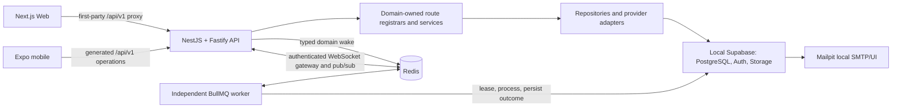

# Architecture modernization certification

Certification date: 2026-09-08

Status: **local and container architecture certified; API-only cleanup verified
against the local database-backed runtime**. This is a
repository/runtime architecture certificate, not approval to launch production
markets, money movement, or unconfigured external providers. Those remain under
the stricter release evidence in
[`../architecture/production-capability-matrix.md`](../architecture/production-capability-matrix.md).

## Compact product title policy

Generic product onboarding now limits newly published titles to 50 characters
through `PUBLICATION_CONSTRAINTS.title.maxLength`. Web and native inputs expose
the same limit and counter; the canonical OpenAPI publication request, backend
publication service and professional CSV import enforce the boundary. Errors
identify the title field. Existing public listings, stored titles and drafts are
not shortened or migrated; over-limit restored or assisted drafts must be edited
explicitly before publication. Dedicated vertical onboarding and digital-version
titles retain their separate contracts.

The value is a rounded-down practical limit, not a universal text-fit guarantee.
At the current homepage dimensions (208 × 402px cards, 182px title width,
13px/18px Nunito Sans), the selected 73-character laser title occupies four lines.
Cards with wrapping seller facts have less title room; sampled ordinary French
text fit approximately 55 characters there. Chromium and WebKit measurements at
1408px and 390px viewports informed rounding down to 50. Wide capitals, emoji and
enlarged fonts can require more room. The existing shared adaptive card height
and full-title wrapping remain necessary and unchanged.

Release/migration scope (product-title policy revision 2): this tightens the
new-publication request contract
(the shared native input previously allowed 120; Web/API had no matching cap).
Treat deployment as a coordinated product-title policy migration, shipping the
Web/native counter and validation before enforcing the backend cap in a hosted
environment. Older client submissions must receive the stable validation error
and prompt an edit, never data truncation. This local implementation does not
certify hosted rollout or older deployed native-client readiness. Revision 1 is
the previous shared 120-character client policy; revision 2 is the unified
50-character publication policy. The hosted release owner must verify supported
native versions and draft-error recovery before activating revision 2, or retain
the previous release. No database migration or existing-data rewrite is required.

Verification for this policy uses boundary/over-limit contract, backend unit,
authenticated API and native HTTP-adapter tests, plus
`frontend/e2e/publication-title-limit.spec.ts` for desktop/mobile counters,
restored draft preservation, input limits and step progression. This check also
guards a reachable title step: an unused unstable translation callback was
removed from the wizard's schema-request effect dependencies, which otherwise
restarted the request on every render and blocked the title step. The shared toast
context now retains its callback-object identity across notification changes;
otherwise a validation notification restarted draft hydration and could overwrite
the seller's correction. The browser regression verifies that draft reads do not
restart when the validation notification appears or disappears. The isolated
production browser build substitutes for `frontend-build` in the shared-system
gate (`make -o frontend-build ui-check cross-platform-check`) to preserve the
running interactive dev server's build directory. Full native/shared completion
remains blocked by the existing Expo/Expo Router patch-version doctor findings;
this change does not upgrade unrelated dependencies.

The final isolated production run passed all four title-flow checks in Chromium
and WebKit at 1408px and 390px widths, including console/overlay health and
notification-safe draft correction. `make frontend-test` passed 686 tests;
Web lint/type checks, backend unit/contract/integration checks, shared contract
checks and `make openapi-check` passed. Native lint/types and 83 tests passed
before the Expo doctor gate. Test processes were cleaned up; the interactive
Web/API/worker processes and existing inventory were retained.

## Final architecture



The architecture remains a TypeScript modular monolith. The modernization
adapted the working domain model instead of replacing it: the canonical
OpenAPI contract still owns HTTP semantics; the 38 domain route families still
own their handlers; PostgreSQL outboxes, inboxes, leases, idempotency records,
and delivery attempts remain authoritative business state.

## Backend and transport

- `NestFactory` creates one `NestFastifyApplication` with the Fastify adapter.
  A narrow catch-all controller delegates canonical `/api/v1` operations to the
  existing domain-owned registrars, preserving their extracted handler bodies
  and avoiding a replacement central controller.
- The transport retains cookies, CSRF, CORS, request IDs, market validation,
  principal/capability checks, rate limits, cache policy, compression, one-MiB
  request bodies, bounded response reads, timeouts, safe errors, and proxy
  policy. Fastify malformed-URL and parser failures use the same safe error
  boundary and request correlation.
- Liveness is shallow. Readiness verifies both the database and Redis and does
  not advertise ready when a required dependency is unavailable.
- API and worker bundles are separate entrypoints in one backend image. The API
  neither starts migrations nor runs background processors.

## Redis, BullMQ, and worker model

Redis 8.2.1 is digest-pinned in the local topology, private to the Compose
network, loopback-bound on host port `REDIS_PORT`, health-checked with
`redis-cli ping`, non-root constrained, append-only, and backed by a named
volume. Hosted environments must inject a protected TLS `REDIS_URL`; production
also requires credentials.

BullMQ's `scheduled-runtime` queue is the durable execution transport for the
27 existing worker responsibilities. Definitions retain their real domain
processors rather than introducing generic fake queues. Jobs use:

- stable names and schema-versioned, typed payloads;
- an environment fingerprint and optional correlation/request ID;
- deterministic domain-wake job IDs for producer deduplication;
- configurable concurrency, bounded locks, exponential retry/backoff, and
  completed/failed retention caps;
- PostgreSQL leases, transactional outboxes/inboxes, and idempotency as the
  authoritative effect boundary;
- structured start, completion, retry, failure, and shutdown logs.

The independent worker connects to Redis and Supabase, registers recurring
BullMQ schedulers, publishes a recent environment-scoped heartbeat, stops
accepting work during graceful shutdown, closes its worker before producer
connections, and can scale independently from the API. Migration
`00115_bullmq_scheduled_job_retry.sql` makes a completed BullMQ delivery
compatible with database-owned retry timing. Migration
`00116_notification_market_rpc_hardening.sql` removes an accidentally
reintroduced pre-market notification overload and keeps the current explicit
market/route RPC aligned with delivery-opportunity notifications.

## Realtime

Nest's WebSocket gateway listens at `/realtime`. A connection must authenticate
within the configured deadline and is limited to a bounded subscription count.
Notification subscriptions are restricted to the authenticated user;
conversation subscriptions load the conversation and enforce participant
membership. Unauthorized resources return the same `NOT_FOUND` result used for
cross-user isolation.

Redis pub/sub fans out schema-versioned envelopes across API replicas. The
gateway covers connect, authenticate, subscribe, publish, unsubscribe,
reconnect, invalid token, isolation, and cleanup behavior. WebSocket traffic is
the documented exception to the generated JSON client.

## Supabase and local mail

`backend/supabase/` remains the single Supabase tree. The local stack supplies
PostgreSQL, Auth, Storage, Realtime, Studio, and Mailpit/Inbucket. Root tooling
renders ignored local configuration, waits on health, applies the ordered
forward migrations, and idempotently loads the production-shaped seed:

- 37 profiles and linked Supabase Auth users;
- 19 marketplace listings plus Auto, Immo, Education, and Employment data;
- messages, transactions, notifications, saved searches, and reviews;
- taxonomy v1, commercial rules, market configuration, and 165 owned Storage
  objects.

Local password recovery uses backend email abstractions and Mailpit SMTP. Live
email provider abstractions remain independent and fail closed when not
configured.

## OpenAPI and generated clients

`backend/openapi/openapi.json` remains the only HTTP authority. Generation now
produces 513 typed JSON operation functions plus the path/operation types,
backend manifest, and endpoint inventory. All normal frontend HTTP adapters and
all mobile business services invoke generated operations through their single
platform transport. The platform transports alone own sessions, first-party
cookies, CSRF, bearer refresh, market headers, cancellation, timeouts, and safe
error normalization.

Audited raw-transport exceptions are limited to:

- WebSocket connections;
- direct upload to backend-issued signed Storage URLs;
- Stripe's third-party SDK/provider endpoint;
- static/native asset fetches and the Web first-party proxy itself.

There is no second business API client. UI view models remain intentional
adapter projections, not duplicate wire-contract authorities.

The commands `make api-export`, `make api-generate`, and `make api-check`
validate the OpenAPI 3.1 document, generated drift, source/access parity,
operation uniqueness, route registration, compilation, and configured
base-contract removals. Local checks report that a breaking-change comparison
is intentionally unavailable when `OPENAPI_BASE_REF` is unset; CI supplies the
base ref.

## Environment and developer lifecycle

The existing six canonical application environments remain `local`, `test`,
`preview`, `development`, `staging`, and `production`. `APP_ENV` selects
behavior; `NODE_ENV` does not select infrastructure or provider policy. Root
commands load and validate one profile, preserve explicit shell overrides, and
derive matching API, database, Supabase, Storage, Web, and mobile fingerprints.

Key runtime variables are:

| Concern      | Variables                                                                     |
| ------------ | ----------------------------------------------------------------------------- |
| Origins      | `PUBLIC_FR_URL`, `PUBLIC_INTL_URL`, `API_URL`                                 |
| Modes        | `BACKEND_DATA_MODE`, `DATABASE_INFRA_MODE`; Web/mobile are API-only           |
| Redis/BullMQ | `REDIS_HOST`, `REDIS_PORT`, `REDIS_URL`, `QUEUE_CONCURRENCY`                  |
| Worker       | `WORKER_GROUPS`, `WORKER_HEALTH_FILE`, `SHUTDOWN_GRACE_MS`                    |
| Supabase     | `DATABASE_URL`, `SUPABASE_URL`, server-only keys and environment fingerprints |
| Local mail   | `LOCAL_MAIL_SMTP_URL`, `SUPABASE_SMTP_PORT`, `SUPABASE_INBUCKET_PORT`         |

`make dev` is the canonical connected native workflow: start/verify Supabase,
Redis, and Mailpit; migrate and seed; then launch API, worker, and API-only Web.
`make frontend` starts that API-only Web client against the configured API. The
root process registry owns only this checkout's PIDs, detects reused/zombie
PIDs, and shuts down leaf-to-root without broad process matching.

## Container architecture

The root Compose topology is shared by hosted deployment; the local override is
the only file that publishes ports, and it binds Web, API, Redis, Supabase, and
Mailpit to loopback. Containers use service DNS (`backend`, `redis`) or the
explicit local-host gateway for the repository-owned Supabase stack—never
another container's `localhost`.

Frontend and backend use digest-pinned Node 22 Alpine multi-stage Dockerfiles,
lockfile installs, cache mounts, non-root runtime users, read-only filesystems,
dropped capabilities, init handling, health checks, and graceful stop periods.
The independent worker reuses the backend image with its own command and health
probe. Build contexts exclude dependencies, build output, credentials, runtime
state, coverage, test results, and Git data. The frontend build reads the
checked-in non-secret local template only to evaluate dynamic route modules;
the template is not copied into the runtime image, whose target configuration
is validated and injected at startup.

## CI/CD and scaling

CI performs lockfile install, environment/migration/security checks, lint,
typecheck, OpenAPI drift, the complete test suite including sockets, production
builds, Compose validation, and clean frontend/backend image builds. Its runtime
integration uses PostgreSQL/Supabase-compatible database configuration plus a
Redis service and verifies API and worker readiness without production secrets.

Web, API, worker, PostgreSQL/Supabase, and Redis are independently scalable.
Queue connections are reused per process; worker concurrency is configured per
environment. Supavisor owns application database pooling. API keep-alive,
header/request deadlines, generated-client bundle limits, bounded search
candidates, queue retention, and provider/database timeouts use typed central
performance defaults.

## Historical local/container certification evidence

The earlier certification ran every required lifecycle command rather than
inferring success from source inspection. These counts belong to that checkpoint,
not the current browser follow-up. Highlights:

- `make install`: lockfile install of 1,245 packages, zero npm audit findings;
- `make test`: 438 test files, 2,677 passing tests, two intentional
  database-workflow skips;
- `make check`: environment, migrations, capabilities, production config,
  formatting, lint, typecheck, OpenAPI, full tests, production builds,
  infrastructure, secret, hostname, and dependency-boundary gates;
- `make build`: shared UI/design packages, Web production build and bundle
  budgets, backend API/worker bundles, and mobile typecheck;
- `make docker-audit`: both runtime images use the non-root `node` user and
  contain no package managers, common secret files, source maps, or Git data;
- `make docker-scan`: the pinned Trivy scanner reported zero HIGH or CRITICAL
  findings in both Alpine runtime images and their Node dependencies;
- OpenAPI: 526 operations across 465 paths, 517 runtime routes, 513 generated
  JSON business operations;
- database: 116 ordered migrations and repeatable seed;
- native foreground starts for Web, API, and independent worker, each probed
  before controlled shutdown;
- clean multi-stage Docker build followed by healthy full-stack startup.

Container smoke evidence includes HTTP 200 for Web, Web health, API liveness,
API readiness, and OpenAPI 3.1; a database-backed listing result with total 17
through both direct API and Web proxy; browser-cookie login with CSRF; favorite
on/off mutation; a password-reset email captured in Mailpit; Redis PING; worker
heartbeat; an authenticated notification socket receiving a Redis-published
event and unsubscribing; and a completed BullMQ job with a persisted delivery
attempt.

## Intentional boundaries after certification

- Database mode deliberately uses an unavailable notification-delivery provider
  until an approved external email/push vendor is configured. The worker records
  bounded retry/dead-letter evidence; local auth email uses Mailpit separately.
- The two pre-existing database tests remain intentionally skipped by the
  ordinary Vitest suite and are owned by their dedicated database workflow.
- Hosted provider activation, production load/restore/alert evidence, legal and
  market approvals, signed container provenance/hosted attestation, and
  mobile-store signing remain release gates. They are not local architecture
  defects and are never fabricated by this certificate.
- `OPENAPI_BASE_REF` is supplied in CI for the base-branch compatibility check;
  an unset local value cannot prove repository-history compatibility.
- `/workspace/pro-analytics/{sellerId}` retains the deprecated numeric
  `monthlyRevenue` and historical ratio for v1 compatibility. Web does not
  present either as currency-safe revenue or an event-cohort conversion rate.
  `revenueByCurrency` is the typed integer-money projection; removal of the
  legacy wire fields requires v2. The catalogue view count is a bounded sample,
  not a complete time-series analytics implementation.

## Browser/API verification follow-up — 2026-09-08

The current follow-up fixes the API-backed browser test boundary and the Pro
dashboard response mapping. It preserves the existing local database and the
interactive development server. No database reset, reseed, hosted deployment,
provider activation or signing operation was performed in this follow-up.

- API-only browser personas use first-party cookies, real Staff MFA and private
  ephemeral recovery codes. A negative test proves local storage cannot grant
  identity or revive the retired switcher.
- Backend-owned seed projection and UUID identifiers power the browser listing
  scenario. Home, detail, search and account tests no longer rely on identifiers
  rejected by the production public-card contract.
- The test runner uses the canonical France origin for direct navigation and
  partitions filtered regular/serial runs without duplicate execution.
- Pro analytics now has an OpenAPI schema and generated response type. The
  shared listing mapper handles top listings, integer revenue stays separated
  by currency, and unsupported weekly trends and conversion cards are removed.
  A business-verification badge requires verified backend profile state.
- The Pro action queue distinguishes unknown messaging state from zero and does
  not infer an empty inventory from an empty analytics sample. Prices reuse the
  shared category-aware price presentation. Revenue describes completed orders
  last updated in the current UTC month, not a new accounting or payout report.
- Public property loading is independent of optional account history and
  recommendations. Only authorized customer accounts record recently viewed
  properties; late responses are ignored after navigation. Buyers must choose
  a future visit time rather than inheriting an expired date.
- Stale title/rating, focus, taxonomy-navigation and course-plan test assumptions
  have been aligned with current behavior without weakening authorization.
- Buyer/seller API publication, persisted favourites, mobile message composer,
  reload and outsider-access checks pass against the isolated API.

Current outcome: **targeted follow-up verified; complete release certification
not issued**. The core non-E2E suites passed 2,226 tests (two intentional
disposable-database skips), and the final selected Chromium/WebKit run passed
36 browser checks. The isolated production build passed; the normal build
target was excluded from `make -o frontend-build check-all` to preserve the
interactive dev server. That gate reached the SDK check and failed on the
system's Command Line Tools selection. A command-scoped Xcode beta selection
then passed the cross-platform gate, reusing its already-passing prerequisites.
No system toolchain selection was changed. Final `make smoke` passed without
stopping the user's Web server, API, worker or database.

Pro dashboard desktop/phone screenshots and console checks confirm the new
metric labels and verified-profile presentation without blank/error content or
horizontal overflow. Test artifacts remain outside the repository.
The exhaustive browser matrix, supported-host Firefox, signed mobile artifacts
and hosted certification were not completed here. Provider/mobile preflights
and environment-owned blockers are recorded in the current follow-up of the
[capability matrix](../architecture/production-capability-matrix.md#current-verification-follow-up--2026-09-08).

## API-only cleanup verification

The Web service registry now loads HTTP adapters only. Client demo adapters,
fixture repositories, data-mode selectors, fabricated provider configuration,
editorial collections, and API-error fallback data were removed. Collections
resolve through API taxonomy and listing inventory; search suggestions use API
results. Backend test scenarios and the explicit local database seed remain
intentional development infrastructure, never a browser fallback. Environment
badges identify the configured application environment instead of claiming that
local data is live production data.

Verification for this cleanup:

- Web: 103 suites / 650 tests, typecheck, lint, production build, and client
  bundle budget checks passed.
- Six additional collection tests passed for API projections, absent inventory
  or media, error propagation, removed editorial slugs, collection details, and
  the shared browser/SSR result limit. That limit now respects the canonical
  search API maximum of 50 instead of sending the retired client-only limit of 60.
- Formatting, repository hygiene, and local-development tooling checks passed.
  Local Docker readiness now uses a bounded server-version probe shared by
  Supabase and Redis; optional `docker info` plugin discovery no longer causes
  a healthy daemon to fail startup preflight.
- Backend typecheck and generated OpenAPI checks passed: 529 operations across
  468 paths, 520 runtime routes, and 516 generated JSON operations.
- Three isolated API-transport browser tests passed, exercising real HTTP,
  cookies, CSRF, account sessions, publication drafts, reviews, and idempotency.
- Database-backed browser checks loaded the homepage, electronics list,
  vehicle map, nine taxonomy collections, and a collection detail without failed
  API requests, JavaScript exceptions, or a Next.js error overlay. Final
  `make smoke` passed for Web, API, worker, Redis, and local Supabase.
- Migration 00117 passed an actual PostgreSQL transaction/rollback check for
  historical preservation and idempotence, plus three regression tests. It
  retires only known obsolete collection selections using the existing audited
  revision writer; it neither deletes marketplace records nor changes archived
  configurations.

Migration 00117 is applied: the final canonical `make db-migrate` reported all
117 migrations current, and the active homepage configuration contains no
obsolete collection selections. Initial attempts encountered PostgreSQL
recovery and a misleading Docker preflight timeout. A data-preserving local
Supabase restart and the direct Docker server probe restored startup. No
database reset was performed. The final collection-detail browser check also
confirmed that the API result-limit correction resolves the earlier HTTP 400.

Local Redis was also recovered with its standard AOF checker after a verified
full-volume backup. Only the invalid 5,115-byte incremental AOF tail was
truncated. The recoverable archive is ignored at
`.runtime/redis-recovery.gT0ww5/redis-data-before-repair.tar.gz`; PostgreSQL
remains authoritative for domain jobs and marketplace records.

## Homepage recent searches and collection restoration

The homepage again renders the published `recent_searches` section instead of
discarding it. The header, search page, and homepage share one browser-local
history hook, partitioned by account and market. Empty history renders no sample
queries or empty section wrapper. History is hidden during session restoration,
validates persisted values, synchronizes between mounted consumers/tabs, and
supports replay and removal. The unscoped v1 key is not adopted because its
contents cannot be attributed safely; its stored contents are left untouched.

Collections now honor explicit automatic versus manual selection. Automatic
selection uses the existing API taxonomy/inventory projection, including real
counts and cover images. Manual selection preserves configured order and never
falls back when empty. Minimum eligible-listing thresholds apply to each
collection's inventory, not the number of collection cards. Loading and retry
states do not introduce fallback inventory. The administration panel exposes
both modes through the existing audited configuration workflow.

Forward migration `00119_restore_automatic_homepage_collections.sql` repairs only
published, enabled collection sections with no explicit selection mode and no
selected slugs. Drafts, disabled sections, manual/custom selections, and historical
section rows are preserved. It also replaces only the exact retired default
editorial subtitle with neutral category-discovery copy. No schema or generated
database type changes are needed. The migration is applied locally: the homepage
API returns revision 5 with `selectionMode: automatic` and the recent-search
section enabled. No dev process was stopped and no marketplace data was deleted.

Verification includes the full frontend suite (671 tests), contracts (281),
frontend lint/type/design-system/navigation/SEO checks, 12 focused restoration
tests, and the transactional PostgreSQL regression:

```bash
make db-shell < backend/tests/rls/homepage-automatic-collections.sql
```

That regression creates temporary scenarios and rolls everything back, proving
manual/disabled/draft isolation, historical preservation, and repeat-application
idempotence. The full backend suite passed 1,066 tests with two intentional skips;
one existing OpenAPI inventory test exceeded its five-second deadline under host
load, then passed in isolation with the two new migration tests (six checks).
The browser run also exposed an exact-category-only filter in the backend test
repository. It now matches PostgreSQL's exact-or-descendant semantics; the added
prefix-boundary regression and existing repository/discovery tests passed (33
checks). This does not introduce a frontend fixture or alter the database path.

Browser verification passed all three flows in Chromium and all three in
WebKit: desktop (1408px), mobile (390px), and authenticated account isolation.
The flows exercise search submission, homepage history, replay, removal and
reload, shared autocomplete state, collection cover images, and collection
detail navigation, with no console errors or horizontal overflow in passing
runs. The initial WebKit attempts exposed test-readiness assumptions: the
regression now waits for the authenticated account menu before searching and
allows a bounded 30-second cold-readiness window, without changing application
timeouts or weakening session-restoration privacy.

```bash
API_PUBLIC_RATE_LIMIT=1000 SHONGRE_E2E_API_TRANSPORT=1 make frontend-test-e2e \
  E2E_ARGS='home-restored-sections.spec.ts --workers=1 --project=chromium --project=webkit'
```

The rate-limit override belongs only to the isolated test API's rapid page-load
sequence; no local/shared/production setting is persisted. Browser plugin was
not available, so the existing Playwright workflow was used. The live
database-backed homepage also rendered real recent history and five collection
cards at both viewport sizes. Cold live-dev interactions during concurrent
builds hit proxy/action timeouts; the dev process was deliberately kept running
as requested, and production-build interactions were verified separately.
Screenshots and failed-attempt evidence are outside the repository under
`/tmp/shongre-home-restoration.DyNoJ8/`. Firefox and remote deployment were not
tested in this restoration task.
Final `make smoke` passed for the Web app, API, worker/heartbeat, Redis and local
Supabase; repository hygiene and formatting checks also passed.

The homepage collection rail and `/collections` catalog now use the existing
`rounded-listing-card` token instead of the larger general-card radius. The
homepage loading placeholder follows the same geometry; media remains clipped
to each card. This is a presentation-only change: inventory, navigation,
selection rules, and the separate collection-detail hero are unchanged. The
collection browser regression compares computed radii with actual listing
cards at desktop (1408px) and mobile (390px), following homepage → catalog →
collection detail.
Verification passed: `make frontend-test` (672 tests), `make frontend-lint`,
formatting and repository hygiene, the isolated production build, and all 12
Chromium/WebKit checks in `collections.spec.ts`. A live Playwright check at
`http://127.0.0.1:3000/` measured matching 10px corners at both viewport sizes,
with working collection links and no console errors or horizontal overflow.
`make smoke` passed after retrying the Web probe that timed out during the
concurrent build. The dev server stayed running. Screenshots are outside the
repository under `/tmp/shongre-collection-radius.XopQw5/`; Firefox and remote
deployment were not retested for this styling change. No obsolete component,
token, or dependency was introduced or left behind.

## Listing online-payment icon

Listing capabilities now select the shared `payment` glyph (credit card) on
Web and native instead of using the shield. Backend eligibility and localized
labels are unchanged. The obsolete payment-to-shield mapping was removed;
the generic shared shield API remains available for security semantics.

Verification passed for the five Web card variants, all 48 shared-feature tests,
18 UI tests, 66 shared-utility tests, 281 contract tests, token/brand checks,
Web/native type checks, and repository hygiene. The isolated production build
and both Chromium payment-icon flows (1408px and 390px) passed. The first
browser attempt incorrectly expected the compact badge's `aria-label` on the
text-labeled hero variant; the corrected test checks accessible text and the
decorative glyph without changing application behavior. The existing responsive
suite excludes WebKit, so a separate live Playwright check verified both widths
in Chromium and WebKit at `http://127.0.0.1:3000/`, including listing-detail
navigation, no page overflow and no console errors.

`make ui-check cross-platform-check -o frontend-build` used the separate isolated
production build to avoid touching the running dev server. Its Expo Doctor step
stopped the complete gate on existing dependency patch mismatches (`expo`
57.0.20 versus expected ~57.0.21 and `expo-router` 57.0.19 versus ~57.0.20);
dependencies were left unchanged. `make contracts-check shared-check` passed
separately. Physical native-device rendering and Firefox were not retested.
Browser plugin was unavailable; screenshots and failed-test evidence remain
outside the repository under `/tmp/shongre-payment-icon.yalanX/`.

## Backend-driven listing characteristics

The listing-detail page now reads `GET /api/v1/listings/{id}/characteristics`
through the generated HTTP operation. The listing domain checks public listing
visibility in the requested market before the taxonomy domain projects saved
values, public detail bindings, localized labels, units, and option labels.
The page no longer invokes publication eligibility to render an existing record.
Missing values and unknown/private fields produce no placeholder rows.

Stored parent categories use only fields common to applicable descendant listing
types, without selecting or persisting a guessed leaf. A backend-only read mapping
retains the existing vehicle keys `year`, `fuel`, `gearbox`, and `critair` until
those persisted records are migrated; canonical fields take precedence. Labels
and options still come from the canonical taxonomy, never a frontend catalogue.
Publication validation remains strict. No database mutation or reset is needed.

The obsolete client-side schema-to-characteristics projector was removed. Data,
loading, empty and retry states remain explicit; public category-label loading is
independent. Verification passed: all 675 frontend tests, 18 focused backend
characteristics/publication tests, the public HTTP integration scenario (guest
and Staff reads, wrong market, invalid locale, draft visibility), Web/backend
lint, contract type checking, OpenAPI drift checks, and repository hygiene.
The isolated production build and all six Chromium/WebKit browser checks passed
at 1408px and 390px, including retry recovery and no publication-resolver request.
Live database-backed checks also verified all seven saved facts on the reported
Peugeot listing, no initial console errors or horizontal overflow, and working
retry recovery in both engines. A one-shot injected failure was initially
consumed by a development remount; keeping the simulated outage active until
the retry action made the test deterministic without changing application logic.

The Browser plugin was unavailable, so verification used Playwright. Screenshots
and temporary scripts stay outside Git under `/tmp/shongre-characteristics.hs4PUC/`.
The existing Web dev server stayed running; no local database records were
modified. Firefox, native consumers, and remote deployments were not retested.
The first smoke check overlapped an API watcher restart and failed its API
probes; readiness recovered to HTTP 200 without stopping any live process, and
the final `make smoke` passed every API, Web, worker, Redis and Supabase probe.

## Equal-width authentication actions

The shared Web `RequireAuth` prompt now uses equal grid columns instead of
content-sized desktop actions. Sign-in and registration remain side by side on
desktop and full-width stacked on mobile. The obsolete `sm:w-auto` overrides
were removed; no new component, token, dependency, or authentication behavior
was introduced. Both destinations retain the requested path, query, and hash.

Verification passed: all 678 frontend tests, frontend lint, formatting,
repository hygiene, final smoke checks, and the isolated production build with
four Chromium/WebKit E2E checks at 1408px and 390px. Live checks on
`/compte/messages` also confirmed equal widths, 44px heights, keyboard sign-in,
registration navigation, no horizontal overflow, and no console errors in both
engines. The dev server stayed running. Browser was unavailable; Playwright
evidence remains outside Git under `/tmp/shongre-auth-buttons.HLEiOO/`.
Firefox and native surfaces were not retested for this Web-only layout change.

## Compact category catalogue cards

`CategoriesPage` now follows the collection catalogue's two-/three-/five-column
grid, 4:3 media, compact typography and padding, and `rounded-listing-card`
corners. Cards keep the API-projected compact category label and section count,
with one keyboard-accessible link for the entire card. Subcategories remain
searchable in the catalogue and selectable on category result pages; the former
chip rows, duplicate card links, hidden-chip counter, and unused counter
translations were removed. Loading placeholders reserve the same compact
anatomy. No taxonomy data, API behavior, visual tokens, or dependencies changed.

Coverage includes projected labels/counts, loading/error/empty states, collection
geometry comparisons, category/subcategory filtering, empty-search recovery,
keyboard navigation, and overflow checks. Browser was unavailable; live
Playwright evidence stays outside Git under
`/tmp/shongre-category-cards.ameE9L/`. Fresh live browser sessions initially hit
the API rate limit; subsequent viewport checks reuse a session without changing
runtime rate limits. The Web dev server remains running.

All 682 frontend tests, frontend lint, formatting, repository hygiene and the
local stack smoke checks passed. Live Chromium/WebKit checks passed at 1408,
768, 390 and 320px with loaded photos, working filters and keyboard navigation,
and no overflow or console errors. The initial production layout test incorrectly
required an image where the isolated API scenario legitimately omits category
media; it now measures the reserved media frame, covering the neutral fallback
as well. The broader alias spec also retains an unrelated failing assertion for
the absent “Niveau Laser Rotatif” listing; catalogue verification selects only
the affected alias check. Firefox, native surfaces and hosted deployments were
not retested for this Web-only change.

The corrected isolated production build and all ten focused Chromium/WebKit
checks passed, including desktop subcategory selection. The run uses
`make frontend-test-e2e` with `category-card-layout.spec.ts` and the catalogue
check from `category-aliases.spec.ts`, selected by
`--grep=category.cards|category.catalogue`; test-only API rate limiting is scoped
to that isolated command. Initial failure artifacts and final test output remain
outside Git with the live screenshots.

## Content-sized listing rails

All listing rails use the shared Web `ListingRail` primitive and the canonical
listing-card width, media height and minimum-height tokens. CSS stretches cards
to the tallest natural card in their own row. Full titles, seller facts and
location/date remain visible, and each section can shrink independently.

The former cross-section height observer and its `ListingRailGroup` wrapper
were removed: a longer title in an unrelated rail should not create empty space
under every other title. This reduces the selected guitar card from 402px to
388px, and its title-to-location gap from 22px to 8px at the reported 1104px
viewport. There are no page-specific card sizes, new visual tokens or native
layout changes. Deferred sections continue to use native content visibility.

The responsive browser regression checks alignment within each rail, complete
titles, clipping, page overflow, horizontal scrolling and keyboard navigation.
It also grows a title in one rail and verifies that an unrelated rail retains
its height, then restores the title and verifies that the affected rail shrinks.
Universe coverage compares rendered cards with the canonical homepage API
response, preserving exact counts without pinning old fixture totals.

The live database-backed app passes Chromium checks at 1104px and 390px,
including full images and titles, row alignment, horizontal scrolling, keyboard
listing navigation and no clipping, overflow or browser errors. Web lint and all
682 unit tests pass. The canonical isolated production build and all six
Chromium browser tests pass at 320, 390, 768 and 1408px, including every universe
rail and independent title growth/shrinkage. Shared token values and native
components are unchanged.

## Canonical commands

```bash
make install
make dev
make dev-status
make dev-down

make frontend
make backend
make worker

make supabase-up
make redis-up
make mail-up
make db-migrate
make db-seed

make api-export
make api-generate
make api-check
make test
make check
make build

make docker-down
make docker-build
make docker-up
make docker-status
make docker-down
```
