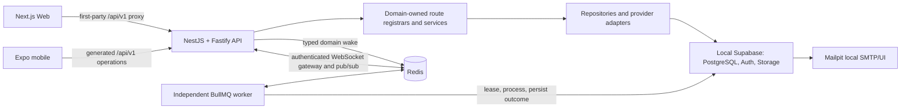

# Architecture modernization certification

Certification date: 2026-09-08

Status: **local and container architecture certified; API-only cleanup verified
against the local database-backed runtime**. This is a
repository/runtime architecture certificate, not approval to launch production
markets, money movement, or unconfigured external providers. Those remain under
the stricter release evidence in
[`../architecture/production-capability-matrix.md`](../architecture/production-capability-matrix.md).

## Final architecture



The architecture remains a TypeScript modular monolith. The modernization
adapted the working domain model instead of replacing it: the canonical
OpenAPI contract still owns HTTP semantics; the 38 domain route families still
own their handlers; PostgreSQL outboxes, inboxes, leases, idempotency records,
and delivery attempts remain authoritative business state.

## Backend and transport

- `NestFactory` creates one `NestFastifyApplication` with the Fastify adapter.
  A narrow catch-all controller delegates canonical `/api/v1` operations to the
  existing domain-owned registrars, preserving their extracted handler bodies
  and avoiding a replacement central controller.
- The transport retains cookies, CSRF, CORS, request IDs, market validation,
  principal/capability checks, rate limits, cache policy, compression, one-MiB
  request bodies, bounded response reads, timeouts, safe errors, and proxy
  policy. Fastify malformed-URL and parser failures use the same safe error
  boundary and request correlation.
- Liveness is shallow. Readiness verifies both the database and Redis and does
  not advertise ready when a required dependency is unavailable.
- API and worker bundles are separate entrypoints in one backend image. The API
  neither starts migrations nor runs background processors.

## Redis, BullMQ, and worker model

Redis 8.2.1 is digest-pinned in the local topology, private to the Compose
network, loopback-bound on host port `REDIS_PORT`, health-checked with
`redis-cli ping`, non-root constrained, append-only, and backed by a named
volume. Hosted environments must inject a protected TLS `REDIS_URL`; production
also requires credentials.

BullMQ's `scheduled-runtime` queue is the durable execution transport for the
27 existing worker responsibilities. Definitions retain their real domain
processors rather than introducing generic fake queues. Jobs use:

- stable names and schema-versioned, typed payloads;
- an environment fingerprint and optional correlation/request ID;
- deterministic domain-wake job IDs for producer deduplication;
- configurable concurrency, bounded locks, exponential retry/backoff, and
  completed/failed retention caps;
- PostgreSQL leases, transactional outboxes/inboxes, and idempotency as the
  authoritative effect boundary;
- structured start, completion, retry, failure, and shutdown logs.

The independent worker connects to Redis and Supabase, registers recurring
BullMQ schedulers, publishes a recent environment-scoped heartbeat, stops
accepting work during graceful shutdown, closes its worker before producer
connections, and can scale independently from the API. Migration
`00115_bullmq_scheduled_job_retry.sql` makes a completed BullMQ delivery
compatible with database-owned retry timing. Migration
`00116_notification_market_rpc_hardening.sql` removes an accidentally
reintroduced pre-market notification overload and keeps the current explicit
market/route RPC aligned with delivery-opportunity notifications.

## Realtime

Nest's WebSocket gateway listens at `/realtime`. A connection must authenticate
within the configured deadline and is limited to a bounded subscription count.
Notification subscriptions are restricted to the authenticated user;
conversation subscriptions load the conversation and enforce participant
membership. Unauthorized resources return the same `NOT_FOUND` result used for
cross-user isolation.

Redis pub/sub fans out schema-versioned envelopes across API replicas. The
gateway covers connect, authenticate, subscribe, publish, unsubscribe,
reconnect, invalid token, isolation, and cleanup behavior. WebSocket traffic is
the documented exception to the generated JSON client.

## Supabase and local mail

`backend/supabase/` remains the single Supabase tree. The local stack supplies
PostgreSQL, Auth, Storage, Realtime, Studio, and Mailpit/Inbucket. Root tooling
renders ignored local configuration, waits on health, applies the ordered
forward migrations, and idempotently loads the production-shaped seed:

- 37 profiles and linked Supabase Auth users;
- 19 marketplace listings plus Auto, Immo, Education, and Employment data;
- messages, transactions, notifications, saved searches, and reviews;
- taxonomy v4, commercial rules, market configuration, and 165 owned Storage
  objects.

Local password recovery uses backend email abstractions and Mailpit SMTP. Live
email provider abstractions remain independent and fail closed when not
configured.

## OpenAPI and generated clients

`backend/openapi/openapi.json` remains the only HTTP authority. Generation now
produces 513 typed JSON operation functions plus the path/operation types,
backend manifest, and endpoint inventory. All normal frontend HTTP adapters and
all mobile business services invoke generated operations through their single
platform transport. The platform transports alone own sessions, first-party
cookies, CSRF, bearer refresh, market headers, cancellation, timeouts, and safe
error normalization.

Audited raw-transport exceptions are limited to:

- WebSocket connections;
- direct upload to backend-issued signed Storage URLs;
- Stripe's third-party SDK/provider endpoint;
- static/native asset fetches and the Web first-party proxy itself.

There is no second business API client. UI view models remain intentional
adapter projections, not duplicate wire-contract authorities.

The commands `make api-export`, `make api-generate`, and `make api-check`
validate the OpenAPI 3.1 document, generated drift, source/access parity,
operation uniqueness, route registration, compilation, and configured
base-contract removals. Local checks report that a breaking-change comparison
is intentionally unavailable when `OPENAPI_BASE_REF` is unset; CI supplies the
base ref.

## Environment and developer lifecycle

The existing six canonical application environments remain `local`, `test`,
`preview`, `development`, `staging`, and `production`. `APP_ENV` selects
behavior; `NODE_ENV` does not select infrastructure or provider policy. Root
commands load and validate one profile, preserve explicit shell overrides, and
derive matching API, database, Supabase, Storage, Web, and mobile fingerprints.

Key runtime variables are:

| Concern      | Variables                                                                     |
| ------------ | ----------------------------------------------------------------------------- |
| Origins      | `PUBLIC_FR_URL`, `PUBLIC_INTL_URL`, `API_URL`                                 |
| Modes        | `BACKEND_DATA_MODE`, `DATABASE_INFRA_MODE`; Web/mobile are API-only           |
| Redis/BullMQ | `REDIS_HOST`, `REDIS_PORT`, `REDIS_URL`, `QUEUE_CONCURRENCY`                  |
| Worker       | `WORKER_GROUPS`, `WORKER_HEALTH_FILE`, `SHUTDOWN_GRACE_MS`                    |
| Supabase     | `DATABASE_URL`, `SUPABASE_URL`, server-only keys and environment fingerprints |
| Local mail   | `LOCAL_MAIL_SMTP_URL`, `SUPABASE_SMTP_PORT`, `SUPABASE_INBUCKET_PORT`         |

`make dev` is the canonical connected native workflow: start/verify Supabase,
Redis, and Mailpit; migrate and seed; then launch API, worker, and API-only Web.
`make frontend` starts that API-only Web client against the configured API. The
root process registry owns only this checkout's PIDs, detects reused/zombie
PIDs, and shuts down leaf-to-root without broad process matching.

## Container architecture

The root Compose topology is shared by hosted deployment; the local override is
the only file that publishes ports, and it binds Web, API, Redis, Supabase, and
Mailpit to loopback. Containers use service DNS (`backend`, `redis`) or the
explicit local-host gateway for the repository-owned Supabase stack—never
another container's `localhost`.

Frontend and backend use digest-pinned Node 22 Alpine multi-stage Dockerfiles,
lockfile installs, cache mounts, non-root runtime users, read-only filesystems,
dropped capabilities, init handling, health checks, and graceful stop periods.
The independent worker reuses the backend image with its own command and health
probe. Build contexts exclude dependencies, build output, credentials, runtime
state, coverage, test results, and Git data. The frontend build reads the
checked-in non-secret local template only to evaluate dynamic route modules;
the template is not copied into the runtime image, whose target configuration
is validated and injected at startup.

## CI/CD and scaling

CI performs lockfile install, environment/migration/security checks, lint,
typecheck, OpenAPI drift, the complete test suite including sockets, production
builds, Compose validation, and clean frontend/backend image builds. Its runtime
integration uses PostgreSQL/Supabase-compatible database configuration plus a
Redis service and verifies API and worker readiness without production secrets.

Web, API, worker, PostgreSQL/Supabase, and Redis are independently scalable.
Queue connections are reused per process; worker concurrency is configured per
environment. Supavisor owns application database pooling. API keep-alive,
header/request deadlines, generated-client bundle limits, bounded search
candidates, queue retention, and provider/database timeouts use typed central
performance defaults.

## Certification evidence

The certification ran every required lifecycle command rather than inferring
success from source inspection. Highlights:

- `make install`: lockfile install of 1,245 packages, zero npm audit findings;
- `make test`: 438 test files, 2,677 passing tests, two intentional
  database-workflow skips;
- `make check`: environment, migrations, capabilities, production config,
  formatting, lint, typecheck, OpenAPI, full tests, production builds,
  infrastructure, secret, hostname, and dependency-boundary gates;
- `make build`: shared UI/design packages, Web production build and bundle
  budgets, backend API/worker bundles, and mobile typecheck;
- `make docker-audit`: both runtime images use the non-root `node` user and
  contain no package managers, common secret files, source maps, or Git data;
- `make docker-scan`: the pinned Trivy scanner reported zero HIGH or CRITICAL
  findings in both Alpine runtime images and their Node dependencies;
- OpenAPI: 526 operations across 465 paths, 517 runtime routes, 513 generated
  JSON business operations;
- database: 116 ordered migrations and repeatable seed;
- native foreground starts for Web, API, and independent worker, each probed
  before controlled shutdown;
- clean multi-stage Docker build followed by healthy full-stack startup.

Container smoke evidence includes HTTP 200 for Web, Web health, API liveness,
API readiness, and OpenAPI 3.1; a database-backed listing result with total 17
through both direct API and Web proxy; browser-cookie login with CSRF; favorite
on/off mutation; a password-reset email captured in Mailpit; Redis PING; worker
heartbeat; an authenticated notification socket receiving a Redis-published
event and unsubscribing; and a completed BullMQ job with a persisted delivery
attempt.

## Intentional boundaries after certification

- Database mode deliberately uses an unavailable notification-delivery provider
  until an approved external email/push vendor is configured. The worker records
  bounded retry/dead-letter evidence; local auth email uses Mailpit separately.
- The two pre-existing database tests remain intentionally skipped by the
  ordinary Vitest suite and are owned by their dedicated database workflow.
- Hosted provider activation, production load/restore/alert evidence, legal and
  market approvals, signed container provenance/hosted attestation, and
  mobile-store signing remain release gates. They are not local architecture
  defects and are never fabricated by this certificate.
- `OPENAPI_BASE_REF` is supplied in CI for the base-branch compatibility check;
  an unset local value cannot prove repository-history compatibility.

## API-only cleanup verification

The Web service registry now loads HTTP adapters only. Client demo adapters,
fixture repositories, data-mode selectors, fabricated provider configuration,
editorial collections, and API-error fallback data were removed. Collections
resolve through API taxonomy and listing inventory; search suggestions use API
results. Backend test scenarios and the explicit local database seed remain
intentional development infrastructure, never a browser fallback. Environment
badges identify the configured application environment instead of claiming that
local data is live production data.

Verification for this cleanup:

- Web: 103 suites / 650 tests, typecheck, lint, production build, and client
  bundle budget checks passed.
- Six additional collection tests passed for API projections, absent inventory
  or media, error propagation, removed editorial slugs, collection details, and
  the shared browser/SSR result limit. That limit now respects the canonical
  search API maximum of 50 instead of sending the retired client-only limit of 60.
- Formatting, repository hygiene, and local-development tooling checks passed.
  Local Docker readiness now uses a bounded server-version probe shared by
  Supabase and Redis; optional `docker info` plugin discovery no longer causes
  a healthy daemon to fail startup preflight.
- Backend typecheck and generated OpenAPI checks passed: 529 operations across
  468 paths, 520 runtime routes, and 516 generated JSON operations.
- Three isolated API-transport browser tests passed, exercising real HTTP,
  cookies, CSRF, account sessions, publication drafts, reviews, and idempotency.
- Database-backed browser checks loaded the homepage, electronics list,
  vehicle map, nine taxonomy collections, and a collection detail without failed
  API requests, JavaScript exceptions, or a Next.js error overlay. Final
  `make smoke` passed for Web, API, worker, Redis, and local Supabase.
- Migration 00117 passed an actual PostgreSQL transaction/rollback check for
  historical preservation and idempotence, plus three regression tests. It
  retires only known obsolete collection selections using the existing audited
  revision writer; it neither deletes marketplace records nor changes archived
  configurations.

Migration 00117 is applied: the final canonical `make db-migrate` reported all
117 migrations current, and the active homepage configuration contains no
obsolete collection selections. Initial attempts encountered PostgreSQL
recovery and a misleading Docker preflight timeout. A data-preserving local
Supabase restart and the direct Docker server probe restored startup. No
database reset was performed. The final collection-detail browser check also
confirmed that the API result-limit correction resolves the earlier HTTP 400.

Local Redis was also recovered with its standard AOF checker after a verified
full-volume backup. Only the invalid 5,115-byte incremental AOF tail was
truncated. The recoverable archive is ignored at
`.runtime/redis-recovery.gT0ww5/redis-data-before-repair.tar.gz`; PostgreSQL
remains authoritative for domain jobs and marketplace records.

## Canonical commands

```bash
make install
make dev
make dev-status
make dev-down

make frontend
make backend
make worker

make supabase-up
make redis-up
make mail-up
make db-migrate
make db-seed

make api-export
make api-generate
make api-check
make test
make check
make build

make docker-down
make docker-build
make docker-up
make docker-status
make docker-down
```
